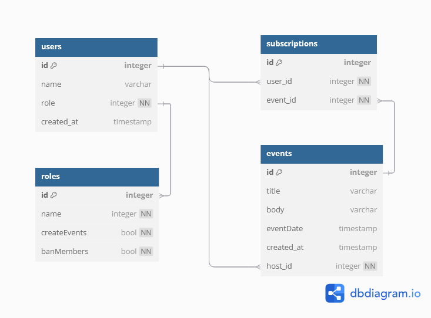

# WAD - Web Application Document - Módulo 2 - Inteli 

## Filmeet


## Sumário

[1. Introdução](#c1)

[2. Visão Geral da Aplicação Web](#c2)

[3. Projeto Técnico da Aplicação Web](#c3)

[4. Desenvolvimento da Aplicação Web](#c4)

[5. Testes da Aplicação Web](#c5)

[6. Estudo de Mercado e Plano de Marketing](#c6)

[7. Conclusões e trabalhos futuros](#c7)

[8. Referências](c#8)

[Anexos](#c9)

<br>


# <a name="c1"></a>1. Introdução 

**Web App Document (WAD) – Filmeet**  

O Filmeet é uma plataforma web desenvolvida para conectar fãs de cinema a eventos exclusivos, como exibições em drive-ins, encontros com atores e sessões especiais. Construído com arquitetura MVC e utilizando Supabase para banco de dados e autenticação, o projeto oferece uma solução escalável e segura para a descoberta e gestão de eventos cinematográficos.  

Com a crescente demanda por experiências interativas no universo do entretenimento, o Filmeet surge como uma ferramenta centralizada, permitindo que usuários encontrem eventos relevantes, realizem inscrições e interajam com outros fãs. A aplicação prioriza uma experiência intuitiva, garantindo acesso rápido e responsivo em diferentes dispositivos.  

Além de facilitar a conexão entre organizadores e participantes, o sistema integra recursos como recomendações personalizadas, notificações em tempo real e avaliações pós-evento, fortalecendo a comunidade cinematográfica. O Filmeet não apenas simplifica o acesso a experiências exclusivas, mas também se posiciona como um hub digital para fãs que buscam ir além da experiência tradicional de cinema.

# <a name="c2"></a>2. Visão Geral da Aplicação Web (sprint 1)

## 2.1. Escopo do Projeto (sprints 1 e 4)

### 2.1.1. Modelo de 5 Forças de Porter (sprint 1)

*Preencha com até 400 palavras*

*Posicione aqui o modelo de 5 Forças de Porter para sustentar o contexto da indústria.*

### 2.1.2. Análise SWOT da Instituição Parceira (sprint 1)

*Preencha com até 100 palavras – sem necessidade de fonte*

*Apresente uma visão geral da situação do parceiro com base na matriz SWOT (forças, fraquezas, oportunidades e ameaças). Foque na relação com os concorrentes e o posicionamento da instituição.*

### 2.1.3. Solução (sprints 1 a 5)

*Explique detalhadamente os seguintes aspectos (até 60 palavras por item):*
1. Problema a ser resolvido
2. Dados disponíveis (mencionar fonte e conteúdo; se não houver, indicar “não se aplica”)
3. Solução proposta
4. Forma de utilização da solução
5. Benefícios esperados
6. Critério de sucesso e como será avaliado

### 2.1.4. Value Proposition Canvas (sprint 1): 
*Sem limite de palavras – usar template do curso*

*Elaborar o Value Proposition Canvas com base na proposta de solução definida.*

### 2.1.5. Matriz de Riscos do Projeto (sprint 1)

<div align = "center">

<sup>Figura 1: Matriz de Riscos do projeto.</sup><br>

<br>

<sub>Fonte: Material produzido pelos autores (2025). </sub><br>

<sup>Quadro 1: Riscos e planos de ação.</sup><br>

\# | Risco | Plano de Ação |
---|---|---|
1| Uma única construção Web não ser suficiente para atender às multiplicidades do problema | Delimitar bem o escopo com o parceiro do projeto
2| Dificuldades no entendimento da plataforma FieldView | Estudar os materiais disponibilizados pela Bayer
3| Dispersões durante os horários de desenvolvimento | Estabelecer a participação de todos os membros durante a daily e fechamento
4| Não conseguir atender todas dores dos PTDs em uma única solução | Se aprofundar nas dores dos PTDs
5| Ferramentas digitais permitidas serem insuficientes para construção Web | Propor bibliotecas e frameworks complementares
6| Solução não ser eficaz para o PTD | Estudar à fundo as diversas dificuldades desses profissionais
7| Caráter técnico do problema dificultar a construção da solução | Destrinchar o problema em pequenos blocos a serem estudados
8| Problemas de conexão de internet na faculdade e na moradia estudantil | Caso possível, buscar meios alternativos à falta de conexão |

<sub>Fonte: Material produzido pelos autores (2025). </sub><br>

<sup>Quadro 2: Oportunidades.</sup><br>
\# | Oportunidades |
---| ----|
1| Desenvolver habilidades em outros eixos do conhecimento
2| Expandir nosso entendimento a respeito de conhecimentos agrários através da plataforma FieldView
3| Desenvolver e aprofundar habilidades em tecnologias de construção Web

<sub>
Fonte: Material produzido pelos autores (2025)
</sub>

</div>

## 2.2. Personas (sprint 1)

*Posicione aqui suas Personas em forma de texto markdown com imagens, ou como imagem de template preenchido. Atualize esta seção ao longo do módulo se necessário.*

## 2.3. User Stories (sprints 1 a 5)

*Posicione aqui a lista de User Stories levantadas para o projeto. Siga o template de User Stories e utilize a mesma referência USXX no roadmap de seu quadro Kanban. Indique todas as User Stories mapeadas, mesmo aquelas que não forem implementadas ao longo do projeto. Não se esqueça de explicar o INVEST das 5 User Stories prioritárias*

*ATUALIZE ESTA SEÇÃO SEMPRE QUE ALGUMA DEMANDA MUDAR EM SEU PROJETO*

*Template de User Story*
Identificação | USXX (troque XX por numeração ordenada das User Stories)
--- | ---
Persona | nome da Persona
User Story | "como (papel/perfil), posso (ação/meta), para (benefício/razão)"
Critério de aceite 1 | CR1: descrever cenário + testes de aceite
Critério de aceite 2 | CR2: descrever cenário + testes de aceite
Critério de aceite ... | CR...
Critérios INVEST | *(Por que é Independente? Por que é Negociável? Por que é Valorosa? Por que é Estimável? Por que é Pequena? Por que é Testável?)*

# <a name="c3"></a>3. Projeto da Aplicação Web (sprints 1 a 4)

## 3.1. Arquitetura (sprints 3 e 4)

*Posicione aqui o diagrama de arquitetura da sua solução de aplicação web. Atualize sempre que necessário*

## 3.2. Wireframes (sprint 2)

*Posicione aqui as imagens do wireframe construído para sua solução e, opcionalmente, o link para acesso (mantenha o link sempre público para visualização)*

## 3.3. Guia de estilos (sprint 3)

*Descreva aqui orientações gerais para o leitor sobre como utilizar os componentes do guia de estilos de sua solução*

### 3.3.1 Cores

*Apresente aqui a paleta de cores, com seus códigos de aplicação e suas respectivas funções*

### 3.3.2 Tipografia

*Apresente aqui a tipografia da solução, com famílias de fontes e suas respectivas funções*

### 3.3.3 Iconografia e imagens 

*(esta subseção é opcional, caso não existam ícones e imagens, apague esta subseção)*

*posicione aqui imagens e textos contendo exemplos padronizados de ícones e imagens, com seus respectivos atributos de aplicação, utilizadas na solução*

## 3.4 Protótipo de alta fidelidade (sprint 3)

*posicione aqui algumas imagens demonstrativas de seu protótipo de alta fidelidade e o link para acesso ao protótipo completo (mantenha o link sempre público para visualização)*

## 3.5. Modelagem do banco de dados (sprints 2 e 4)

### 3.5.1. Modelo relacional (sprints 2 e 4)



### 3.5.2. Consultas SQL e lógica proposicional (sprint 2)

```sql
CREATE TABLE roles (
  id SERIAL PRIMARY KEY,
  name TEXT NOT NULL,
  create_Events BOOLEAN,
  ban_Members BOOLEAN
);

CREATE TABLE users (
  id SERIAL PRIMARY KEY,
  name TEXT NOT NULL,
  role INT REFERENCES roles(id) ON DELETE CASCADE,
  created_at DATE 
);

CREATE TABLE events (
 id SERIAL PRIMARY KEY,
 title TEXT,
 body TEXT,
 event_Date DATE,
 created_at DATE,
 host INT REFERENCES users(id) ON DELETE CASCADE
);

CREATE TABLE subscriptions (
  id SERIAL PRIMARY KEY,
  user_id INT REFERENCES users(id) ON DELETE CASCADE,
  event_id INT REFERENCES events(id) ON DELETE CASCADE
);

INSERT INTO roles (name, createEvents, banMembers) 
VALUES ('User',false,false),
       ('Host',true,false),
       ('Admin',true,true);


INSERT INTO users (name, role) 
VALUES ('Antonio',3);


SELECT * FROM users;
-- SELECT * FROM roles;
```
*posicione aqui uma lista de consultas SQL compostas, realizadas pelo back-end da aplicação web, com sua respectiva lógica proposicional, descrita conforme template abaixo. Lembre-se que para usar LaTeX em markdown, basta você colocar as expressões entre $ ou $$*

*Template de SQL + lógica proposicional*
#1 | ---
--- | ---
**Expressão SQL** | SELECT * FROM suppliers WHERE (state = 'California' AND supplier_id <> 900) OR (supplier_id = 100); 
**Proposições lógicas** | $A$: O estado é 'California' (state = 'California') <br> $B$: O ID do fornecedor não é 900 (supplier_id ≠ 900) <br> $C$: O ID do fornecedor é 100 (supplier_id = 100)
**Expressão lógica proposicional** | $(A \land B) \lor C$
**Tabela Verdade** | <table> <thead> <tr> <th>$A$</th> <th>$B$</th> <th>$C$</th> <th>$(A \land B)$</th> <th>$(A \land B) \lor C$</th> </tr> </thead> <tbody> <tr> <td>F</td> <td>F</td> <td>F</td> <td>F</td> <td>F</td> </tr> <tr> <td>F</td> <td>F</td> <td>V</td> <td>F</td> <td>V</td> </tr> <tr> <td>F</td> <td>V</td> <td>F</td> <td>F</td> <td>F</td> </tr> <tr> <td>F</td> <td>V</td> <td>V</td> <td>F</td> <td>V</td> </tr> <tr> <td>V</td> <td>F</td> <td>F</td> <td>F</td> <td>F</td> </tr> <tr> <td>V</td> <td>F</td> <td>V</td> <td>F</td> <td>V</td> </tr> <tr> <td>V</td> <td>V</td> <td>F</td> <td>V</td> <td>V</td> </tr> <tr> <td>V</td> <td>V</td> <td>V</td> <td>V</td> <td>V</td> </tr> </tbody> </table>

*Dica: edite a tabela verdade fora do markdown, para ter melhor controle*

## 3.6. WebAPI e endpoints (sprints 3 e 4)

*Utilize um link para outra página de documentação contendo a descrição completa de cada endpoint. Ou descreva aqui cada endpoint criado para seu sistema.* 

*Cada endpoint deve conter endereço, método (GET, POST, PUT, PATCH, DELETE), header, body e formatos de response*

# <a name="c4"></a>4. Desenvolvimento da Aplicação Web

## 4.1. Primeira versão da aplicação web (sprint 3)

*Descreva e ilustre aqui o desenvolvimento da sua primeira versão do sistema web, explicando brevemente o que foi entregue em termos de código e sistema. Utilize prints de tela para ilustrar. Indique as eventuais dificuldades e próximos passos.*

## 4.2. Segunda versão da aplicação web (sprint 4)

*Descreva e ilustre aqui o desenvolvimento da sua segunda versão do sistema web, explicando brevemente o que foi entregue em termos de código e sistema. Utilize prints de tela para ilustrar. Indique as eventuais dificuldades e próximos passos.*

## 4.3. Versão final da aplicação web (sprint 5)

*Descreva e ilustre aqui o desenvolvimento da última versão do sistema web, explicando brevemente o que foi entregue em termos de código e sistema. Utilize prints de tela para ilustrar. Indique as eventuais dificuldades e próximos passos.*

# <a name="c5"></a>5. Testes

## 5.1. Relatório de testes de integração de endpoints automatizados (sprint 4)

*Liste e descreva os testes unitários dos endpoints criados, automatizados e planejados para sua solução. Posicione aqui também o relatório de cobertura de testes Jest se houver (através de link ou transcrito para estrutura markdown)*

## 5.2. Testes de usabilidade (sprint 5)

*Posicione aqui as tabelas com enunciados de tarefas, etapas e resultados de testes de usabilidade. Ou utilize um link para seu relatório de testes (mantenha o link sempre público para visualização)*

# <a name="c6"></a>6. Estudo de Mercado e Plano de Marketing (sprint 4)

## 6.1 Resumo Executivo

*Preencher com até 300 palavras, sem necessidade de fonte*

*Apresente de forma clara e objetiva os principais destaques do projeto: oportunidades de mercado, diferenciais competitivos da aplicação web e os objetivos estratégicos pretendidos.*

## 6.2 Análise de Mercado

*a) Visão Geral do Setor (até 250 palavras)*
*Contextualize o setor no qual a aplicação está inserida, considerando aspectos econômicos, tecnológicos e regulatórios. Utilize fontes confiáveis.*

*b) Tamanho e Crescimento do Mercado (até 250 palavras)*
*Apresente dados quantitativos sobre o tamanho atual e projeções de crescimento do mercado. Utilize fontes confiáveis.*

*c) Tendências de Mercado (até 300 palavras)*
*Identifique e analise tendências relevantes (tecnológicas, comportamentais e mercadológicas) que influenciam o setor. Utilize fontes confiáveis.*

## 6.3 Análise da Concorrência

*a) Principais Concorrentes (até 250 palavras)*
*Liste os concorrentes diretos e indiretos, destacando suas principais características e posicionamento no mercado.*

*b) Vantagens Competitivas da Aplicação Web (até 250 palavras)*
*Descreva os diferenciais da sua aplicação em relação aos concorrentes, sem necessidade de citação de fontes.*


## 6.4 Público-Alvo

*a) Segmentação de Mercado (até 250 palavras)*
Descreva os principais segmentos de mercado a serem atendidos pela aplicação. Utilize bases de dados e fontes confiáveis.*

*b) Perfil do Público-Alvo (até 250 palavras)*
*Caracterize o público-alvo com dados demográficos, psicográficos e comportamentais, incluindo necessidades específicas. Utilize fontes obrigatórias.*


## 6.5 Posicionamento

*a) Proposta de Valor Única (até 250 palavras)*
*Defina de maneira clara o que torna a sua aplicação única e valiosa para o mercado.*

*b) Estratégia de Diferenciação (até 250 palavras)*
*Explique como sua aplicação se destacará da concorrência, evidenciando a lógica por trás do posicionamento.*

## 6.6 Estratégia de Marketing 

*a) Produto/Serviço (até 200 palavras)*
*Descreva as funcionalidades, benefícios e diferenciais da aplicação*

*6.2 Preço (até 200 palavras)*
*Explique o modelo de precificação adotado e justifique com base nas análises anteriores.*

*6.3 Praça (Distribuição) (até 200 palavras)*
*Apresente os canais digitais utilizados para distribuir e entregar a aplicação ao público.*

*6.4 Promoção (até 200 palavras)*
*Descreva as estratégias digitais planejadas, como SEO, redes sociais, marketing de conteúdo e campanhas pagas.*

# <a name="c7"></a>7. Conclusões e trabalhos futuros (sprint 5)

*Escreva de que formas a solução da aplicação web atingiu os objetivos descritos na seção 2 deste documento. Indique pontos fortes e pontos a melhorar de maneira geral.*

*Relacione os pontos de melhorias evidenciados nos testes com planos de ações para serem implementadas. O grupo não precisa implementá-las, pode deixar registrado aqui o plano para ações futuras*

*Relacione também quaisquer outras ideias que o grupo tenha para melhorias futuras*

# <a name="c8"></a>8. Referências (sprints 1 a 5)

_Incluir as principais referências de seu projeto, para que seu parceiro possa consultar caso ele se interessar em aprofundar. Um exemplo de referência de livro e de site:_<br>

LUCK, Heloisa. Liderança em gestão escolar. 4. ed. Petrópolis: Vozes, 2010. <br>
SOBRENOME, Nome. Título do livro: subtítulo do livro. Edição. Cidade de publicação: Nome da editora, Ano de publicação. <br>

INTELI. Adalove. Disponível em: https://adalove.inteli.edu.br/feed. Acesso em: 1 out. 2023 <br>
SOBRENOME, Nome. Título do site. Disponível em: link do site. Acesso em: Dia Mês Ano

# <a name="c9"></a>Anexos

*Inclua aqui quaisquer complementos para seu projeto, como diagramas, imagens, tabelas etc. Organize em sub-tópicos utilizando headings menores (use ## ou ### para isso)*